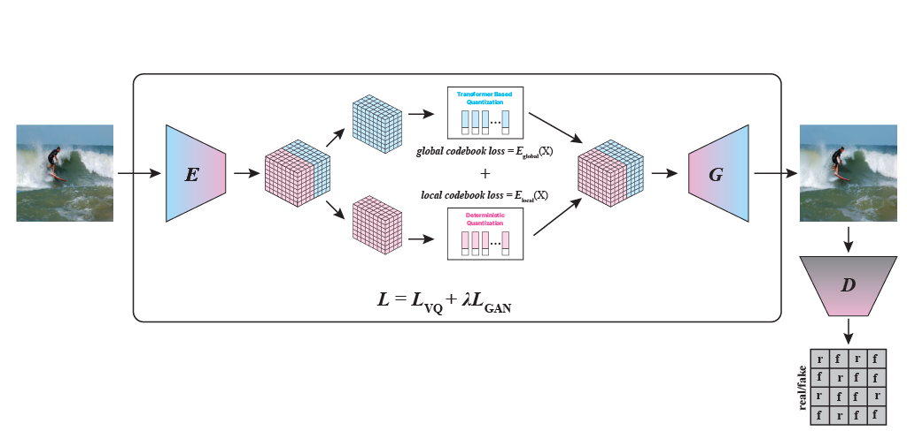
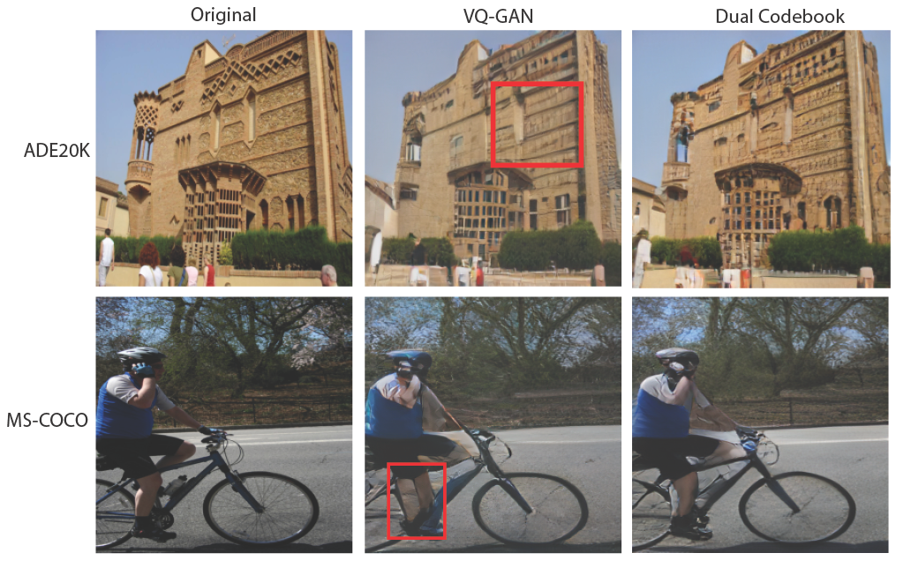
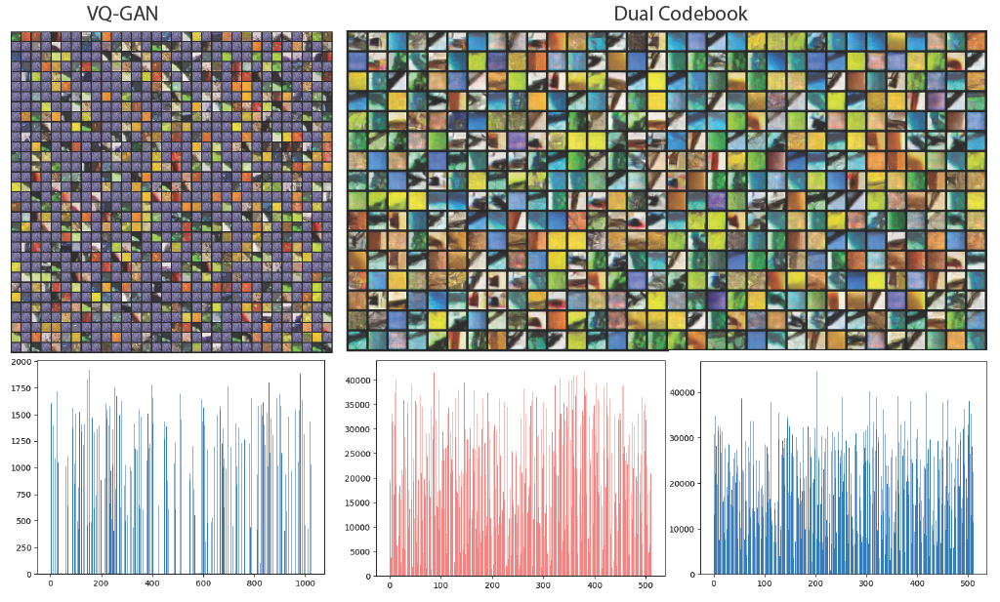
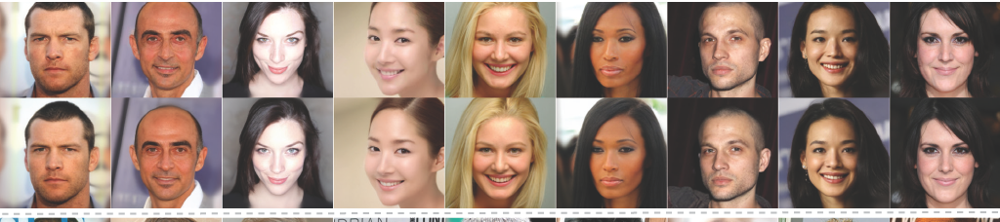

# Dual Codebook VQGAN

This repository contains the implementation of our Dual Codebook Vector Quantized Generative Adversarial Network (DC-VQGAN), which enhances image representation learning by utilizing separate codebooks for capturing different aspects of visual information.

## Overview

Our DC-VQGAN model extends the original VQGAN architecture by introducing a dual codebook approach that integrates transformer-based and graph-based techniques to create more effective visual representations. The model separately encodes and quantizes different aspects of visual information, resulting in improved reconstruction quality and codebook utilization.



## Features

- **Dual Codebook Quantization**: Utilizes separate codebooks for different aspects of visual information
- **Graph-based Codebook Integration**: Leverages graph neural networks to capture relationships between codebook entries
- **Transformer Integration**: Employs transformer components to enhance feature representation
- **Improved Codebook Utilization**: Achieves better codebook utilization compared to standard VQGAN
- **High-Quality Reconstruction**: Produces higher quality reconstructions across various datasets

## Qualitative Results

The following figure shows qualitative comparisons between our DC-VQGAN model and the original VQGAN:



Our model produces reconstructions with finer details and better preservation of the original image content.

## Codebook Utilization

One of the key advantages of our approach is improved codebook utilization:



The dual codebook approach helps to avoid codebook collapse issues often seen in VQ models.

## Model Performance

Our model demonstrates strong reconstruction capabilities across different datasets:



## Installation

1. Clone this repository:
   ```bash
   git clone https://github.com/yourusername/dual-codebook-vqgan.git
   cd dual-codebook-vqgan
   ```

2. Create and update the environment variables in `.env`:
   ```bash
   USER_HOME="/home/user"
   DATA_PATH="/data/dataset"
   PROJECT_PATH="${USER_HOME}/projects/dual-codebook-vqgan"
   LOGS_PATH="${PROJECT_PATH}/logs"
   MODEL_OUTPUTS="${LOGS_PATH}/model_outputs"
   PRETRAINED_WEIGHTS="${PROJECT_PATH}/pretrained_weights"
   ```

3. Install the required packages:
   ```bash
   pip install -r requirements.txt
   ```

## Usage

### Training

To train the model on your dataset:
```bash
python main.py --config configs/celebhq_vqgan_trans_graph.yaml
```

### Testing

To evaluate a trained model:
```bash
python main.py --config configs/celebhq_vqgan_trans_graph.yaml --test --ckpt /path/to/checkpoint.ckpt
```

## Configuration

The model can be configured through YAML configuration files. An example configuration is provided in `configs/celebhq_vqgan_trans_graph.yaml`.

## Dataset Preparation

Prepare your dataset with the following structure:
```
dataset_root/
├── train/
│   └── *.jpg
├── val/
│   └── *.jpg
└── test/
    └── *.jpg
```

## Citations

This work builds upon several previous contributions:

```
@inproceedings{esser2021taming,
  title={Taming Transformers for High-Resolution Image Synthesis},
  author={Esser, Patrick and Rombach, Robin and Ommer, Bjorn},
  booktitle={Proceedings of the IEEE/CVF Conference on Computer Vision and Pattern Recognition},
  pages={12873--12883},
  year={2021}
}

@article{yu2021vector,
  title={Vector-quantized image modeling with improved VQGAN},
  author={Yu, Jiahui and Li, Xin and Koh, Jing Yu and Zhang, Han and Zhou, Ruoming and Pang, Yonghui and Terrell, James and Huang, Jason and Tian, Yukun and Bai, Huizhong and others},
  journal={arXiv preprint arXiv:2110.04627},
  year={2021}
}
```

## License

This project is licensed under the MIT License - see the LICENSE file for details.

## Acknowledgements

We thank the authors of VQGAN for releasing their code, which served as a foundation for our work.